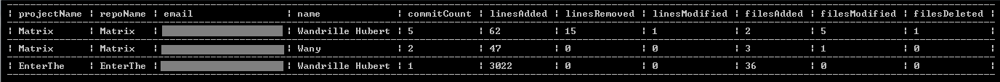

# TFS/Azure DevOps Code Statistics

This is a simple poc console application to be able to gather code statistics by project/repo/user.  Works with git projects only.

## Getting Started

Update tfsUrl and personalaccesstoken found in the Program.cs file.  

Can take a while to run especially with large/many projects/lots of commits.

## Results

Two different types of results are possible:
- the number of commits broken up by project/repo/user
- the number of commits, lines added, lines removed, lines modified, files added, files modified, files deleted broken up by project/repo/user

The results are presented to the console window in a table format such as the one shown below:

&nbsp;  
&nbsp;
Furthermore, it is also possible to export the results to a csv file, and this is done through the WriteToCsv functions.